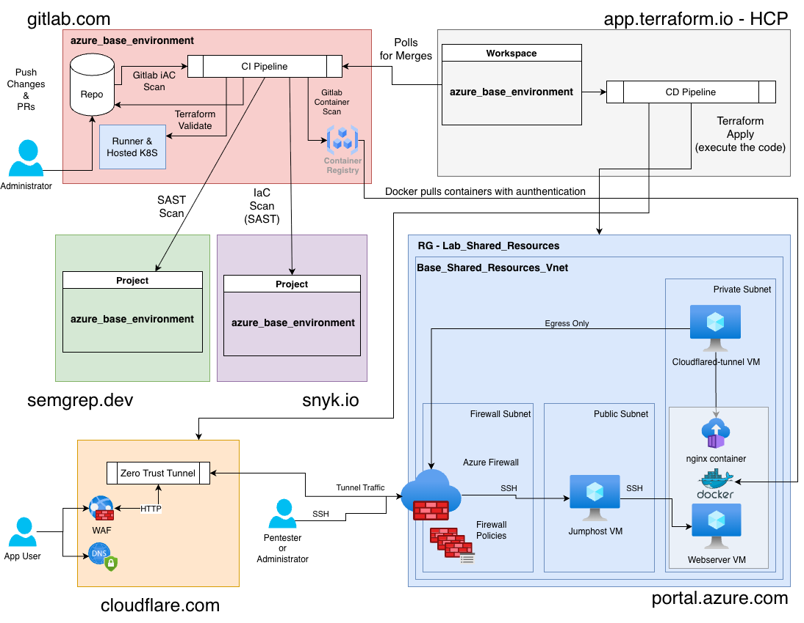

# azure_base_environment

## Getting started

This is a modular base Terraform template for use with Gitlab and HCP Terraform to deploy basic resources in Azure.

It is a demo environment only but will create some basic Azure resources to demonstrate the full workflow.

Resources included in the template:
 - Resrouce Group
    - Virtual Network
        - Subnet
         - Network Security Group
            - Network Security Rule
        - Firewall
            - Firewall Rules
            - Public IP Address
    - Linux Virtual Machine
        - Virtual Nic

## Environment Architecture

